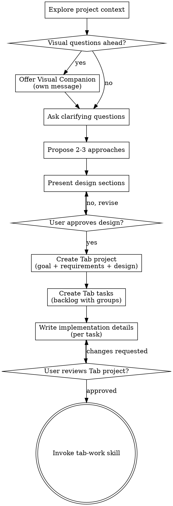

# Brainstorming Ideas Into Designs (Tab Edition)

Turn ideas into fully formed designs through collaborative dialogue, persisting everything to Tab for Projects via MCP.

Start by understanding what the user wants to build, ask questions one at a time, then save the design and backlog to Tab.

<HARD-GATE>
Do NOT invoke any implementation skill, write any code, scaffold any project, or take any implementation action until you have presented a design and the user has approved it. This applies to EVERY project regardless of perceived simplicity.
</HARD-GATE>

## Project Types

Determine the project type early — it affects workspace location, conventions, and which verification tools to use.

| Type | Workspace | Branch naming | Commit format | Verification |
|------|-----------|---------------|---------------|--------------|
| **PlexTrac** | `~/workspaces/plextrac/{repo}` | `{TICKET-KEY}-{kebab}` | `{TICKET-KEY}: description` | `/verify` (repo-specific) |
| **Personal** | `~/workspaces/{project-slug}` | `{project-slug}-{kebab}` | Short descriptive message | `/tab-verify` (auto-detect) |

**PlexTrac projects:**
- Originate from a Jira ticket (user says "brainstorm IO-2097" or provides a ticket key)
- Include the Jira key in the Tab project title: `"IO-2097: Integration Usage Tracking"`
- Follow PlexTrac CLAUDE.md standards for the target repo
- Use the PlexTrac PR template when creating PRs
- Notes go in `~/workspaces/plextrac/notes/{TICKET-KEY}/`

**Personal projects:**
- No Jira ticket — user describes an idea directly (e.g. "lets build doot")
- Tab project title is just the project name: `"doot"`
- Workspace at `~/workspaces/{project-slug}/`
- No specific coding standards imposed (follow language conventions)
- Notes go in the project directory: `{project-dir}/notes/`

## Starting from a Jira ticket

When the user provides a Jira ticket key (e.g. "brainstorm IO-2097", "start a project from IO-2097"):

1. **Check Tab first** — call `list_projects` to see if a Tab project already exists for this ticket (search for the ticket key in titles). If one exists, load it and resume from where it left off instead of creating a new project.
2. **Search KB documents** — call `list_documents` filtered by relevant tags (e.g. `integration` for integration tickets, `architecture` for architecture work). Load relevant documents with `get_document` for context.
3. **Check for related skills** — look for implementation skills that might have pre-built research or architecture references for this type of work (e.g. `new-integration` for integration tickets, `plextrac-work` for general PlexTrac work). These skills often contain architecture snapshots, file path references, and patterns that seed brainstorming.
4. **Check for related Tab projects** — if similar work was done before (e.g. IO-2131 Rapid7 is a template for IO-2132 CrowdStrike), load the related project's tasks as a structural reference.
5. Check `~/workspaces/plextrac/notes/{TICKET-KEY}/` for existing research
6. If no research exists, fetch the ticket from Jira MCP
7. Pre-load the ticket's title, description, and acceptance criteria as context
8. Proceed with brainstorming — the ticket content seeds the conversation instead of starting from scratch
9. Create the Tab project with `{TICKET-KEY}: {title}` as the project title

## Importing existing work into Tab

When a ticket already has completed work (e.g. progress.md with done BE work, an open PR), convert it to a Tab project with done tasks:

1. Read `notes/{TICKET-KEY}/progress.md` and any PRs for context
2. Create the Tab project with goal, requirements, and design (including what's already built)
3. Create tasks for completed work with `status: "done"` — **ALL fields must be populated** including `plan` and `implementation`:
   - `plan`: How the work was approached (steps, key decisions, reference patterns)
   - `implementation`: What was built (files, PR links, branch names)
4. Create tasks for remaining work with `status: "todo"`
5. Batch create works great — set mixed statuses in a single `create_task` call

This makes past projects into referenceable patterns for future similar work.

## Anti-Pattern: "This Is Too Simple To Need A Design"

Every project goes through this process. The design can be short for simple projects, but you MUST present it and get approval.

## Checklist

You MUST create a task for each of these items and complete them in order:

1. **Explore project context** — check Tab for existing projects, **search KB documents by relevant tags** (architecture, conventions, integration, etc.), check for related skills/architecture references, check files, docs, recent commits (if existing codebase)
2. **Offer visual companion** (if topic will involve visual questions) — its own message, not combined with a clarifying question
3. **Ask clarifying questions** — one at a time, understand purpose/constraints/success criteria
4. **Propose 2-3 approaches** — with trade-offs and your recommendation
5. **Present design** — in sections scaled to their complexity, get user approval after each section
6. **Create Tab project** — save goal, requirements, and design to Tab via `mcp__tab-for-projects__create_project`
7. **Create Tab tasks** — break implementation into tasks with descriptions, effort, impact, categories, and group_keys via `mcp__tab-for-projects__create_task`
8. **Write implementation details** — update each task with exact implementation steps and acceptance criteria via `mcp__tab-for-projects__update_task`
9. **Create/attach KB documents** — extract reusable knowledge into Tab documents, attach relevant existing documents to the project
10. **User reviews Tab project** — ask user to review the project and tasks in Tab before proceeding
11. **Transition to implementation** — invoke the **tab-work** skill to execute the project

## Tab Persistence (replaces local spec files)

Instead of writing spec files to `docs/superpowers/specs/`, persist everything to Tab:

### Creating the Project
```
mcp__tab-for-projects__create_project({
  items: [{
    title: "project name",
    goal: "one-line goal",
    requirements: "- bullet list of requirements",
    design: "## Section\nFull design in markdown"
  }]
})
```

### Creating Tasks (the backlog)
```
mcp__tab-for-projects__create_task({
  items: [{
    project_id: "<id from create>",
    title: "Task title",
    description: "What needs to be done",
    category: "feature|infra|test|...",
    effort: "trivial|low|medium|high|extreme",
    impact: "trivial|low|medium|high|extreme",
    group_key: "logical-group"  // max 32 chars
  }]
})
```

### Adding Implementation Details
```
mcp__tab-for-projects__update_task({
  items: [{
    id: "<task id>",
    project_id: "<project id>",
    implementation: "Exact code snippets, function signatures, step-by-step",
    acceptance_criteria: "- Specific pass/fail checks"
  }]
})
```

### Marking Tasks Done
```
mcp__tab-for-projects__update_task({
  items: [{ id: "<task id>", project_id: "<project id>", status: "done" }]
})
```

## Knowledge Base (Documents)

Tab Documents are a **shared knowledge base** across projects. They're standalone entities that can be attached to many projects — architecture decisions, conventions, troubleshooting guides, and reference material that's reusable across work.

### When to search the KB

During **Step 1 (Explore project context)**, search for relevant documents:

```
mcp__tab-for-projects__list_documents({ tag: "architecture" })
mcp__tab-for-projects__list_documents({ tag: "conventions" })
mcp__tab-for-projects__list_documents({ tag: "integration" })  // for integration work
```

Load any relevant documents with `get_document` and use them as context for the brainstorming conversation.

### When to create documents

After the design is approved, evaluate: **did this brainstorming produce reusable knowledge?**

- **Architecture decisions** that apply beyond this project → create document tagged `[architecture, decision]`
- **Conventions** discovered during research → `[conventions]`
- **Reference material** (API schemas, field mappings, patterns) → `[reference]`

```
mcp__tab-for-projects__create_document({
  items: [{
    title: "Integration Architecture — Synqly Vulnerability Plugin",
    content: "## Pattern\n...",
    tags: ["integration", "architecture", "reference"]
  }]
})
```

### Attaching documents to the project

When creating the Tab project, attach any relevant existing documents:

```
mcp__tab-for-projects__update_project({
  items: [{
    id: "<project_id>",
    attach_documents: ["<doc_id_1>", "<doc_id_2>"]
  }]
})
```

This makes the documents available when tab-work loads the project — sub-agents get them as context automatically.

### Tags reference

| Category | Tags | Use for |
|----------|------|---------|
| **Domain** | `ui`, `data`, `integration`, `infra`, `domain` | What area the knowledge covers |
| **Content Type** | `architecture`, `conventions`, `guide`, `reference`, `decision`, `troubleshooting` | What kind of document it is |
| **Concern** | `security`, `performance`, `testing`, `accessibility` | Cross-cutting concerns |

## Process Flow



## The Process

**Understanding the idea:**

- Check out the current project state first (files, docs, recent commits) if working in an existing codebase
- Before asking detailed questions, assess scope: if the request describes multiple independent subsystems, flag this immediately
- If the project is too large for a single project, help decompose into sub-projects
- Ask questions one at a time to refine the idea
- Prefer multiple choice questions when possible
- Only one question per message
- Focus on understanding: purpose, constraints, success criteria

**Exploring approaches:**

- Propose 2-3 different approaches with trade-offs
- Lead with your recommended option and explain why

**Presenting the design:**

- Present the design section by section
- Scale each section to its complexity: a few sentences if straightforward, up to 200-300 words if nuanced
- Ask after each section whether it looks right so far
- Cover: architecture, components, data flow, error handling, testing
- Be ready to go back and clarify if something doesn't make sense

**Design for isolation and clarity:**

- Break the system into smaller units with one clear purpose each
- Well-defined interfaces, independently testable

**Working in existing codebases:**

- Follow existing patterns. Don't propose unrelated refactoring.

## After the Design

**Save to Tab:**

1. Create a Tab project with the approved goal, requirements, and full design
2. Break the design into implementation tasks with:
   - Clear titles (imperative form)
   - Descriptions with enough context for a sub-agent to execute
   - `group_key` to organize tasks logically (e.g., "setup", "core", "art", "testing", "release")
   - `effort` and `impact` ratings
   - `category` (feature, infra, test, etc.)
3. Update each task with exact `implementation` details (code snippets, function signatures, commands)
4. Update each task with `acceptance_criteria` (specific pass/fail checks)
5. Create Tab documents for any reusable knowledge (architecture patterns, conventions, reference material) and attach them to the project via `update_project({ items: [{ id, attach_documents: [doc_ids] }] })`

**Keep Tab in sync:**

- When the design changes during implementation, update the Tab project's `design` and `requirements` fields
- When tasks are completed, mark them `done`
- When new tasks are discovered, add them to the Tab backlog

**User Review Gate:**

> "Project and tasks saved to Tab. Please review and let me know if you want any changes before we start implementation."

Wait for the user's response. Only proceed once approved.

**Implementation:**

- Invoke the **tab-work** skill to execute the project
- tab-work handles: research → branch → implement → verify → review → fix → commit
- tab-work uses **tab-verify** for automated test/lint/typecheck with bug task creation

## Key Principles

- **One question at a time** - Don't overwhelm with multiple questions
- **Multiple choice preferred** - Easier to answer than open-ended when possible
- **YAGNI ruthlessly** - Remove unnecessary features from all designs
- **Explore alternatives** - Always propose 2-3 approaches before settling
- **Incremental validation** - Present design, get approval before moving on
- **Tab is the source of truth** - All project state lives in Tab, not local files
- **Be flexible** - Go back and clarify when something doesn't make sense
- **Build the KB** - Extract reusable knowledge into documents; future projects benefit from past brainstorming

## Visual Companion

A browser-based companion for showing mockups, diagrams, and visual options during brainstorming. Available as a tool — not a mode.

**Offering the companion:** When you anticipate visual questions, offer it once:
> "Some of what we're working on might be easier to explain if I can show it to you in a web browser. Want to try it? (Requires opening a local URL)"

**This offer MUST be its own message.** Wait for the user's response.

**Per-question decision:** Even after the user accepts, decide FOR EACH QUESTION whether to use the browser or the terminal:
- **Use the browser** for visual content — mockups, wireframes, layout comparisons, architecture diagrams
- **Use the terminal** for text content — requirements questions, conceptual choices, tradeoff lists

If they agree, read the detailed guide: `skills/brainstorming/visual-companion.md`
